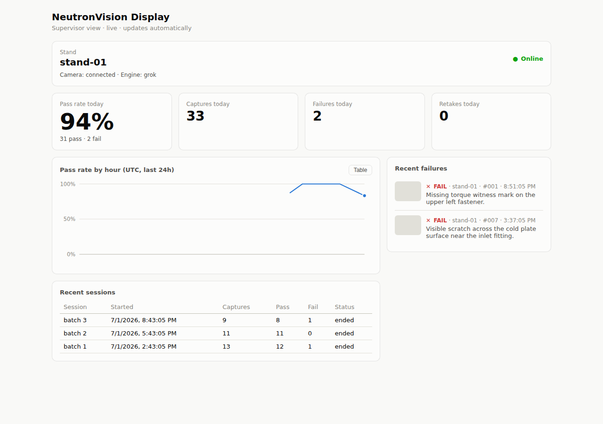

# NeutronVision Display

Supervisor dashboard for NeutronVision checker stands: one screen that shows
what every stand is doing right now, today's pass rate, and the latest
failures with the VLM's rationale — without walking to the bench.

```
[ checker stand (PyQt6 app) ] --events--> [ backend (FastAPI + SQLite) ] --WS--> [ web (Next.js) ]
```

- **Checker side**: the checker appends every session/capture/verdict event to
  a local spool file and a background thread ships it — the operator UI never
  blocks on the network, and a dashboard outage loses nothing (events replay
  when it returns; ingest is idempotent by `event_id`).
- **Backend**: token-gated ingest (`POST /api/events`), read API, and a
  WebSocket that pushes each event to open dashboards.
- **Web**: single-stand supervisor view — stand status (heartbeat-derived),
  KPI tiles, hourly pass-rate chart (with table view), failure feed, recent
  sessions. Light and dark mode.

The full event contract is in [`EVENTS.md`](EVENTS.md).



## Deploy (cloud, single host)

```bash
cd dashboard
DISPLAY_TOKEN=$(openssl rand -hex 24) docker compose up -d --build
```

Then put a TLS-terminating reverse proxy in front, routing `/api/*` to
`backend:8000` and everything else to `web:3000` on one domain. With a single
domain the web app needs no build-time config (it talks to `/api` same-origin);
otherwise pass `NEXT_PUBLIC_API_BASE=https://api.example.com` as a compose env.

The one secret is `DISPLAY_TOKEN`: the checker uses it to push events, and the
supervisor types it once into the browser (stored in localStorage).

## Point a checker stand at it

In `~/NeutronVision/config.json` on the stand:

```json
{
  "dashboard_url": "https://display.example.com",
  "stand_id": "stand-01"
}
```

and add the token to `~/NeutronVision/secrets.env`:

```bash
DASHBOARD_TOKEN=<the same token>
```

Restart the checker. It heartbeats every 30 s and streams session events;
offline periods are spooled to `~/NeutronVision/dashboard_spool.jsonl` and
flushed when connectivity returns.

## Development

Backend:

```bash
cd dashboard/backend
python3.11 -m venv .venv && source .venv/bin/activate
pip install -e ".[dev]"
pytest
DISPLAY_TOKEN=dev uvicorn display_backend.main:app --reload
```

Web:

```bash
cd dashboard/web
npm install
NEXT_PUBLIC_API_BASE=http://localhost:8000 npm run dev
```

## API surface

| Route | Auth | Purpose |
|---|---|---|
| `POST /api/events` | `X-API-Key` | Ingest one event or a batch (spool flush) |
| `GET /api/overview` | `X-API-Key` | Stands + today's metrics + hourly buckets + failures + sessions |
| `GET /api/sessions?limit=` | `X-API-Key` | Session list |
| `GET /api/sessions/{key}` | `X-API-Key` | Session detail incl. captures |
| `WS /api/live?token=` | query token | Slim event push (thumbnails stripped) |
| `GET /api/health` | none | Liveness probe |

## Not in scope (v0.1)

Multi-user auth, per-stand tokens, retention/pruning, alerting
(Telegram/email on FAIL), and multi-stand grid layout — the data model
already supports many stands; the UI simply renders one tile per stand.
