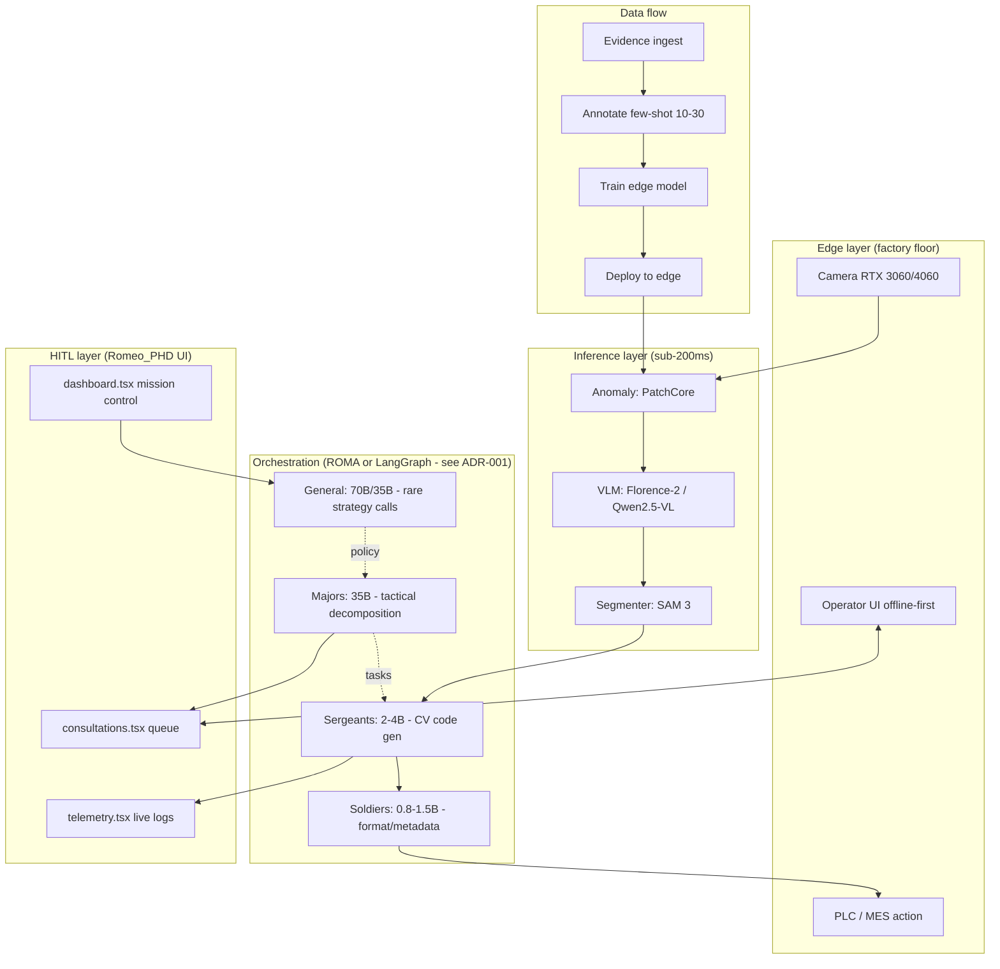

# Architecture v1.0 — Hybrid Hierarchical Multi-Agent Graph

**Status:** 🟡 DRAFT (Phase 1 in progress, target sign-off: 2026-05-19)
**Owner:** Founder (architect role)
**Sign-off requires:** ADR-001, ADR-002, ADR-003, ADR-004 all merged

## 1. Why this document exists

До Phase 1 архитектура была распылена по чатам, Mermaid-наброскам и README. Research постоянно перевыбирал core (ROMA → LangGraph → DeepAgents → Moltis → …), из-за чего MVP нельзя было собрать. Этот документ — single source of truth.

Правило: изменения в core architecture только через новый ADR в `docs/decisions/`. Новые идеи — в backlog Research Agent’а.

## 2. Layers (overview)

## 3. Hierarchy roles

Основа: [`docs/brigada-architecture.md`](brigada-architecture.md) (уже формализована).

| Role | Model class | Frequency | Responsibility |
|---|---|---|---|
| General | 70B/35B FP8 | 1× на 50-200 примеров | Strategy, conflict resolution, system error analysis |
| Major | 35B | десятки/батч | Tactical decomposition, mid-pipeline audit |
| Sergeant | 2-4B | сотни/батч | CV code generation, parameter selection |
| Soldier | 0.8-1.5B FP8 | тысячи/батч | Format checks, metadata, classification |

Детали — в [ADR-002](decisions/adr-002-hierarchy-roles.md).

## 4. Edge inference stack

Baseline (до ADR-003 sign-off):
- Anomaly detection: PatchCore (uchucha)
- VLM grounding: Florence-2 или Qwen2.5-VL
- Segmentation: SAM 3 (если проходит 200ms budget) либо лёгкий fallback

Финальный выбор — [ADR-003](decisions/adr-003-edge-inference-stack.md).

## 5. HITL boundary

Текущий Romeo_PHD UI (`consultations.tsx`) уже имеет pause/resume механизм через `pipeline-executor.ts`. Нужно решить — какие решения ДОЛЖНЫ идти через оператора:

- General-level strategy update? — ДА (founder/QC engineer)
- Major-level rejection? — НЕТ (auto-retry)
- Borderline defect classification? — ДА (operator)

Детали — [ADR-004](decisions/adr-004-hitl-boundary.md).

## 6. Open decisions (blocking sign-off)

| ADR | Question | Status |
|---|---|---|
| ADR-001 | ROMA vs LangGraph vs Moltis as orchestrator | 🟡 PROPOSED |
| ADR-002 | Exact model sizes per hierarchy level | ⚪️ TODO |
| ADR-003 | Edge inference stack lock | ⚪️ TODO |
| ADR-004 | HITL boundary policy | ⚪️ TODO |

## 7. What is OUT of scope for v1.0

- Buxter CAD MAS (отдельный trail в Romeo_PHD, не в RoboQC core)
- Synthetic data generation pipeline (это tooling, не production runtime)
- Voice-gateway (experimental surface, не blocking pilot)
- A2A protocol (добавим после v1.0, если окажется нужным для cross-pilot orchestration)
