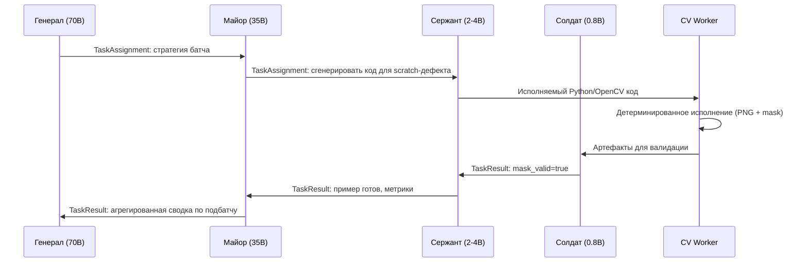
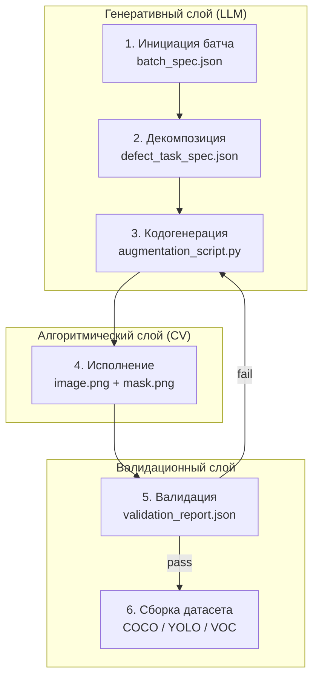
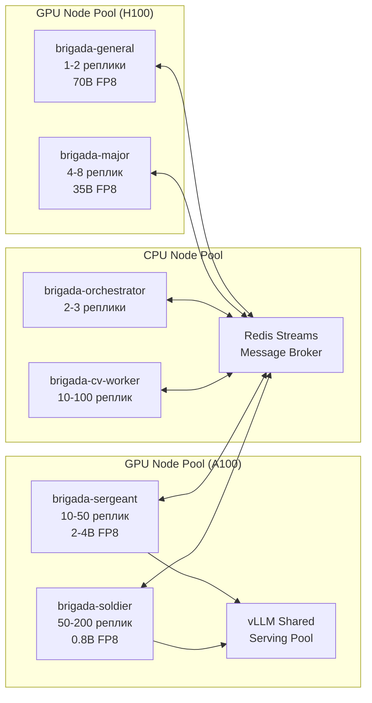
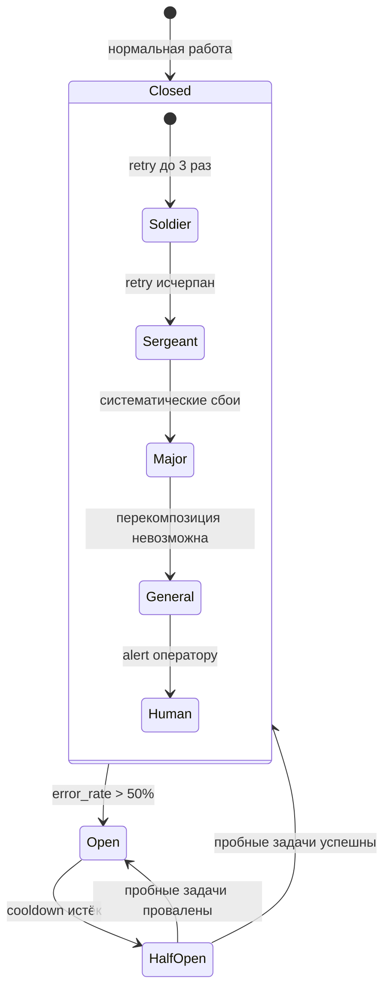
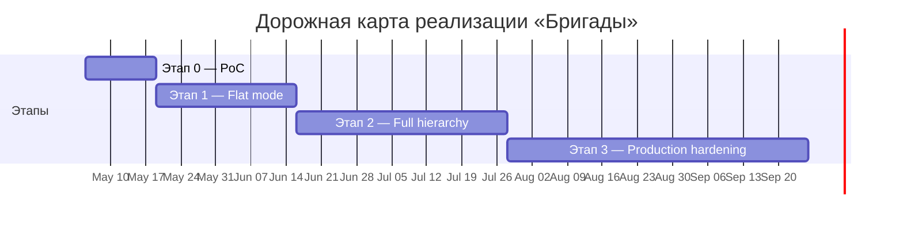

# Архитектура многоагентной системы «Бригада»

## Научно-техническое обоснование архитектуры

Исследовательские работы по synthetic data generation показывают, что в задачах со строго структурированным форматом данных наилучшие результаты часто достигаются не за счёт «чистой» генерации одним LLM, а за счёт разделения ролей между генеративным компонентом и отдельным алгоритмическим или распределенческим слоем. В частности, в работе DiffLM на семи реальных датасетах структурированных данных — tabular, code и tool data — авторы показали, что synthetic data в отдельных downstream-задачах может превосходить реальные данные на 2–7%. Для данной системы это важно не как прямое доказательство качества synthetic computer vision, а как подтверждение архитектурного принципа: чем жёстче требования к формату, логике, геометрии и воспроизводимости, тем полезнее отделять генеративный интеллект от детерминированного слоя правил и преобразований.

В предлагаемой многоагентной системе этот принцип реализуется следующим образом: LLM-агенты не выполняют пиксельную генерацию изображения напрямую, а отвечают за декомпозицию задачи, выбор стратегии дефекта, генерацию и проверку кода, а также за координацию пайплайна. Сами же геометрические преобразования, сборка масок, наложение артефактов, контроль координат и экспорт аннотаций выполняются алгоритмически — средствами OpenCV, PIL, Albumentations и сегментационных моделей. Такая схема лучше соответствует задачам synthetic defect generation, где критичны не «красивые» картинки, а точность масок, повторяемость и управляемость распределения дефектов. Этот вывод является инженерным следствием из результатов DiffLM, а не прямой экстраполяцией их экспериментальных метрик на CV-домен.

### Инфраструктура инференса и роль vLLM

Для достижения высокой пропускной способности при большом количестве параллельных агентов система может использовать vLLM как основной serving layer для малых и средних моделей. Ключевая идея vLLM состоит в том, что bottleneck LLM-инференса часто смещается в управление KV cache, а не только в вычислительные блоки GPU. Авторы vLLM показывают, что традиционные serving-системы могут терять 60–80% памяти из-за fragmentation и over-reservation, тогда как PagedAttention позволяет перейти к near-zero waste в KV-cache и, в сочетании с continuous batching, даёт прирост пропускной способности примерно в 2–4 раза при сопоставимой задержке относительно более ранних систем.

Для данного проекта это означает, что масштабирование «бригады» должно строиться не вокруг одной большой модели, а вокруг эффективного размещения большого числа коротких, дешёвых и асинхронных вызовов. vLLM особенно полезен там, где десятки или сотни солдат обрабатывают независимые задачи: генерацию кода аугментации, классификацию дефекта, проверку валидности маски, выбор параметров преобразования. В такой архитектуре выигрыш от PagedAttention и continuous batching напрямую превращается в рост concurrency и снижение стоимости на единицу синтетического примера.

При этом важно не смешивать между собой бенчмарки разных serving stack'ов. Показатели для vLLM, TensorRT-LLM, Dynamo, SGLang или кастомных inference backends не являются взаимозаменяемыми без точного указания модели, precision, длины входа и выходной последовательности, batch size и режима декодирования. Поэтому в проектной документации любые цифры по throughput должны указываться только вместе с конфигурацией эксперимента.

### Аппаратная платформа: A100 и H100

При развёртывании малых и средних моделей класса 0.8B–14B существенную роль играет не только nominal compute, но и пропускная способность памяти GPU. NVIDIA A100 80GB SXM предоставляет 80 GB HBM2e и около 2,039 GB/s bandwidth памяти, тогда как NVIDIA H100 SXM предоставляет 80 GB HBM3, около 3.35 TB/s bandwidth и аппаратную поддержку FP8 Tensor Core операций. На H100 также увеличена пропускная способность NVLink — до 900 GB/s для SXM-конфигурации, что особенно важно при многомодельной или много-GPU оркестрации.

С практической точки зрения это означает следующее. A100 остаётся сильной и экономически разумной платформой для большого числа «солдат» и «сержантов» в диапазоне до нескольких миллиардов параметров, особенно если архитектура опирается на краткие промпты, короткие ответы и жёстко ограниченный кодогенерационный цикл. H100 становится оправданным там, где требуется более высокая плотность запросов, большее число одновременных агентов, более агрессивное batch scheduling, а также эффективная работа с FP8-чекпойнтами и более тяжёлыми управляющими моделями. Иными словами, A100 подходит для «широкой» дешёвой бригады, а H100 — для сценариев, где критичны throughput, плотность обслуживания и headroom по памяти и latency.

### FP8 и малые модели в иерархии агентов

Для этой архитектуры особенно важна совместимость малых и средних моделей с эффективными форматами хранения и инференса. В экосистеме Qwen уже доступны официальные или поддерживаемые FP8-варианты некоторых моделей, а в model cards прямо указана поддержка использования через vLLM, SGLang и другие inference frameworks. Одновременно сами разработчики отмечают, что FP8-режим следует рассматривать как практический компромисс ради удобства и производительности, а итоговая стабильность зависит от конкретного backend и конфигурации запуска. То есть FP8 здесь следует трактовать не как «бесплатное ускорение без рисков», а как важный инструмент инженерной оптимизации, который требует собственной валидации на ваших задачах генерации кода и агентной оркестрации.

В контексте исходной идеи это означает, что многоуровневая схема с небольшим числом более мощных командиров и большим числом дешёвых солдат действительно технически жизнеспособна. Однако её ценность определяется не самим фактом добавления уровней 70B / 35B / 2–4B / 0.8B, а правильным разделением ролей между ними. Крупные модели имеют смысл оставлять для редких задач высокого уровня: проектирование стратегии дефектов, пересмотр политики генерации, анализ системных ошибок, формирование новых правил валидации и разрешение конфликтов между агентами. Основной же поток работы — генерация CV-кода, параметризация аугментаций, лёгкая валидация, подготовка метаданных — должен быть отдан маленьким моделям и детерминированному CV-слою, поскольку именно это обеспечивает масштабируемость и приемлемую стоимость системы.

### Архитектурный вывод для проекта

Таким образом, архитектурная эффективность системы определяется не максимальной мощностью одной модели, а правильным разделением ролей между генеративным, алгоритмическим и оркестрационным слоями. Генеративный слой отвечает за планирование, интерпретацию, кодогенерацию и контроль; алгоритмический слой — за геометрию, маски, CV-преобразования, сборку датасета и воспроизводимость; инфраструктурный слой — за высокоплотный serving и параллельную обработку задач. Именно такая композиция лучше всего соответствует целям проекта: высокой пропускной способности, контролируемой стоимости, воспроизводимому качеству synthetic data и возможности масштабировать систему от прототипа до промышленного пайплайна.

---

## Иерархия агентов: генерал → майоры → сержанты → солдаты

Предлагаемая многоуровневая структура агентов строится по военной аналогии и отражает принцип разделения ответственности по сложности и частоте задач:

### Генерал

Одна или две экземпляра модели класса 70B или 35B в FP8/FP16 — высший уровень планирования и стратегического контроля. Отвечает за формирование общей политики генерации дефектов на текущий батч, выбор глобальной стратегии (например, «преимущественно царапины + редкие включения металла»), анализ системных ошибок предыдущих итераций, создание/обновление правил валидации и разрешение конфликтов между нижестоящими агентами. Генерал вызывается редко (1 раз на 50–200 синтетических примеров) и работает с максимально полным контекстом всего пайплайна.

### Майоры

Модели 35B/70B, 4–8 параллельных экземпляров — тактический уровень. Получают от генерала стратегию и декомпозируют её на конкретные подзадачи для группы солдат: выбор типа дефекта, генерация параметров аугментации, предварительная проверка семантики будущего кода. Майоры также выполняют промежуточный аудит масок и могут отклонить/перепланировать задачу до передачи вниз.

### Сержанты

Модели 2–4B, десятки параллельных экземпляров — оперативный уровень. Генерируют готовый исполняемый CV-код (Albumentations + OpenCV), подбирают численные параметры преобразований и проводят лёгкую синтаксическую/логическую валидацию. Основная масса «умной» работы, где требуется понимание библиотек и геометрии, но ещё не нужна максимальная дешевизна.

### Солдаты

Модели 0.8B–1.5B, сотни параллельных экземпляров — исполнительный уровень. Выполняют самые простые и массовые операции: классификация уже сгенерированного кода/маски по заранее определённым шаблонам, генерация коротких метаданных, финальная проверка формата аннотаций. Почти все солдаты работают на FP8 и минимальном контексте.

### Плюсы иерархии

- Чёткое разделение ролей позволяет крупным моделям сосредоточиться на действительно сложных задачах, а малым — на массовом дешёвом инференсе.
- Снижение общей стоимости на порядок по сравнению с «всё 70B».
- Лёгкость масштабирования: солдаты и сержанты горизонтально масштабируются на A100, майоры и генерал — на H100.
- Встроенная отказоустойчивость: при сбое солдата задача автоматически перекидывается на другого без потери стратегии.

### Минусы иерархии

- Добавляется латентность координации (2–4 дополнительных вызова LLM на пример).
- Возрастает сложность оркестрации (нужен надёжный message broker и система приоритетов).
- Риск «каскадного» ухудшения качества, если майор или генерал примет неверное решение на старте.
- Переусложнение для простых дефектов (например, одиночные царапины) — в таком случае иерархия превращается в ненужную задержку.

### Рекомендация по применению

Усложнение иерархии оправдано в следующих сценариях:

- Дефекты высокой вариативности (множественные пересекающиеся типы, сложная геометрия, зависимость от материала/освещения).
- Необходимость динамического обновления политики генерации «на лету» (например, при обнаружении систематического смещения в датасете).
- Требование максимальной воспроизводимости и аудита (каждый уровень оставляет traceable лог).

В остальных случаях (простые одиночные дефекты, стабильный пайплайн, бюджет жёстко ограничен) рекомендуется **упрощённый режим**:

- Генерал + майоры отключаются или сводятся к одному статическому промпту.
- Основная работа передаётся напрямую сержантам и солдатам + детерминированному CV-слою.
- Это даёт прирост throughput на 30–50% и снижение latency на 40–60% при практически идентичном качестве на простых задачах.

Таким образом, иерархия — не самоцель, а управляемый инструмент. Система должна поддерживать оба режима (full-hierarchy и flat) с возможностью переключения через конфигурационный флаг, чтобы на этапе эксплуатации выбирать оптимальный trade-off между интеллектом и скоростью/стоимостью.

---

## Коммуникация между агентами и API-контракты

Иерархия агентов превращается в работающую систему только при наличии чётко определённого протокола обмена сообщениями. Каждое межагентное сообщение представляет собой конверт стандартного формата, содержащий `task_id` (уникальный идентификатор задачи), `trace_id` (сквозной идентификатор для distributed tracing), `from_role` и `to_role` (роли отправителя и получателя), `priority` (приоритет задачи) и `payload` (содержимое, специфичное для типа сообщения). Единый формат конверта позволяет message broker'у маршрутизировать сообщения без знания внутренней семантики payload, а системе наблюдаемости — строить полный trace по цепочке `trace_id` через все уровни иерархии.

### Паттерны коммуникации

Система использует три фундаментальных паттерна обмена:

**Command (сверху вниз)** — генерал передаёт стратегию майорам, майоры декомпозируют задачи для сержантов, сержанты формируют микрозадачи для солдат. Каждая команда содержит deadline, после которого задача считается просроченной и подлежит переназначению.

**Report (снизу вверх)** — солдаты отправляют результаты сержантам, сержанты агрегируют и передают майорам, майоры формируют сводки для генерала. Report содержит статус (`success`, `failure`, `partial`), метрики исполнения и, при необходимости, описание ошибки.

**Lateral (горизонтальный)** — сержанты одного уровня могут обмениваться нагрузкой при дисбалансе очередей. Этот паттерн реализуется через общий топик message broker'а и активируется только при превышении порога разницы в глубине очередей (например, >2x).

### Пример: TaskAssignment (генерал → майор)

```json
{
  "task_id": "batch-2026-0042-strategy",
  "trace_id": "tr-7f3a9b2e-1d4c",
  "from_role": "general",
  "to_role": "major",
  "priority": "high",
  "timestamp": "2026-05-01T10:30:00Z",
  "payload": {
    "type": "task_assignment",
    "batch_id": "batch-2026-0042",
    "target_count": 500,
    "strategy": {
      "defect_distribution": {"scratch": 0.4, "dent": 0.3, "inclusion": 0.2, "crack": 0.1},
      "severity_range": [0.3, 0.9],
      "material": "steel_cold_rolled"
    },
    "deadline": "2026-05-01T12:00:00Z",
    "validation_rules_version": "v3.2"
  }
}
```

### Пример: TaskResult (солдат → сержант)

```json
{
  "task_id": "batch-2026-0042-scratch-0137-validate",
  "trace_id": "tr-7f3a9b2e-1d4c",
  "from_role": "soldier",
  "to_role": "sergeant",
  "priority": "normal",
  "timestamp": "2026-05-01T11:14:22Z",
  "payload": {
    "type": "task_result",
    "status": "success",
    "parent_task_id": "batch-2026-0042-scratch-0137",
    "result": {
      "mask_valid": true,
      "annotation_format_ok": true,
      "defect_area_ratio": 0.034,
      "confidence": 0.92
    },
    "metrics": {
      "inference_time_ms": 45,
      "tokens_used": 128
    }
  }
}
```

### Идемпотентность и контракт ошибок

Каждый `task_id` уникален и служит ключом идемпотентности: повторная доставка сообщения с тем же `task_id` не должна приводить к дублированию работы. Агент-получатель обязан проверять `task_id` в локальном журнале выполненных задач и отбрасывать дубликаты. Ошибки передаются через Report с полем `status: "failure"` и структурированным `error_code`, что позволяет вышестоящему агенту принять решение о retry, переназначении или эскалации без парсинга свободного текста.

### Жизненный цикл одного синтетического примера



В flat-режиме генерал и майоры исключаются из цепочки: сержант получает задачу напрямую из статической конфигурации, а результат валидации солдатом возвращается непосредственно сержанту, который агрегирует итоги без промежуточных уровней.

---

## Поток данных: от задания до синтетического примера

Полный пайплайн генерации синтетических данных проходит через шесть последовательных стадий, каждая из которых производит конкретный артефакт. Чёткое определение стадий и их артефактов необходимо для отладки, аудита и возможности перезапуска пайплайна с любой промежуточной точки.

### Стадии пайплайна

1. **Инициация батча** — генерал (или статический конфиг в flat-режиме) определяет целевое количество примеров, распределение дефектов по типам, диапазон severity, материал и версию правил валидации. Артефакт: `batch_spec.json`.

2. **Декомпозиция** — майоры разбивают батч на индивидуальные задачи генерации с конкретными параметрами каждого дефекта: тип, геометрические ограничения, параметры текстуры, целевая область на изображении. Артефакт: массив `defect_task_spec.json`.

3. **Кодогенерация** — сержанты на основе спецификации генерируют исполняемый Python-код, использующий OpenCV, PIL и Albumentations для создания дефекта. Код детерминирован при фиксированном seed. Артефакт: `augmentation_script.py`.

4. **Исполнение** — детерминированный CV-слой (без участия LLM) выполняет сгенерированный скрипт. На вход подаётся чистое изображение, на выход — изображение с дефектом и бинарная маска. Артефакт: `image.png` + `mask.png`.

5. **Валидация** — солдаты проверяют корректность маски (непустая, в пределах изображения, соответствует заявленному типу дефекта), формат аннотации и соответствие параметрам задачи. Артефакт: `validation_report.json`.

6. **Сборка датасета** — прошедшие валидацию примеры агрегируются в целевой формат (COCO, YOLO, Pascal VOC) с генерацией общего файла аннотаций и статистики распределения. Артефакт: `dataset/` с аннотациями и изображениями.

### Граница генеративного и алгоритмического слоёв

Стадии 1–3 относятся к генеративному слою, где LLM-агенты принимают решения и генерируют код. Стадия 4 — это чисто алгоритмический слой, где исполняется детерминированный код без участия LLM. Стадии 5–6 — валидационный слой, где лёгкие LLM-модели и алгоритмические проверки работают совместно. Такое разделение гарантирует, что ни один пиксель не зависит от стохастического поведения LLM: вся «случайность» контролируется через seed в CV-коде.



При сбое на стадии валидации задача возвращается на кодогенерацию (стадия 3) с описанием причины отказа, что позволяет сержанту скорректировать код без пересмотра стратегии на уровне майора. Если повторные попытки (до 3) не приводят к успеху, задача эскалируется на уровень выше.

---

## Развёртывание и оркестрация

### Контейнерная топология

Система развёртывается как набор из шести групп контейнеров, каждая из которых отвечает за свою роль в иерархии:

| Сервис | Реплики | GPU | Модель | Назначение |
|---|---|---|---|---|
| `brigada-general` | 1–2 | H100 | 70B/35B FP8 | Стратегическое планирование |
| `brigada-major` | 4–8 | H100/A100 | 35B/70B FP8 | Тактическая декомпозиция |
| `brigada-sergeant` | 10–50 | A100 | 2–4B FP8 | Кодогенерация CV |
| `brigada-soldier` | 50–200 | A100 | 0.8–1.5B FP8 | Валидация и классификация |
| `brigada-cv-worker` | 10–100 | CPU/GPU | — | Детерминированное исполнение CV-кода |
| `brigada-orchestrator` | 2–3 | CPU | — | Маршрутизация, очереди, координация |

### Message broker

Для межагентного обмена сообщениями используется Redis Streams или NATS JetStream. Выбор обусловлен требованиями: гарантированная доставка (at-least-once), consumer groups для распределения нагрузки между репликами одной роли, persistence для аудита и replay, а также низкая задержка (sub-millisecond) для lateral-обмена между сержантами. Каждая роль читает из своего consumer group, что обеспечивает автоматическое распределение задач между репликами без дополнительной логики.

### vLLM serving: shared vs dedicated

Два подхода к организации vLLM-инстансов:

**Shared** — один кластер vLLM обслуживает несколько ролей (например, сержантов и солдат). Плюсы: лучшая утилизация GPU, меньше idle. Минусы: риск interference между ролями, сложнее изолировать SLA.

**Dedicated** — отдельные vLLM-инстансы для каждой роли. Плюсы: изоляция, предсказуемая задержка, независимое масштабирование. Минусы: фрагментация ресурсов, потенциальный idle при неравномерной нагрузке.

Рекомендация: dedicated-инстансы для генерала и майоров (критичность решений оправдывает изоляцию), shared — для сержантов и солдат (высокая однородность нагрузки, выигрыш от батчинга).

### Автомасштабирование

HPA (Horizontal Pod Autoscaler) настраивается по глубине очереди сообщений для каждой роли, а не по утилизации CPU/GPU. Метрика `queue_depth_per_role` экспортируется из message broker'а в Prometheus и используется как custom metric для HPA. Пороги: scale-up при >10 pending задач на реплику, scale-down при <2.

### Пример конфигурации

```yaml
brigada:
  mode: "full-hierarchy"   # "full-hierarchy" | "flat"

  roles:
    general:
      model: "Qwen3-70B-FP8"
      vllm_endpoint: "http://vllm-general:8000/v1"
      replicas: 1
      max_context_tokens: 32768
      gpu_type: "H100"

    major:
      model: "Qwen3-35B-FP8"
      vllm_endpoint: "http://vllm-major:8000/v1"
      replicas: 4
      max_context_tokens: 16384
      gpu_type: "H100"

    sergeant:
      model: "Qwen3-4B-FP8"
      vllm_endpoint: "http://vllm-workers:8000/v1"   # shared
      replicas: 30
      max_context_tokens: 8192
      gpu_type: "A100"

    soldier:
      model: "Qwen3-0.6B-FP8"
      vllm_endpoint: "http://vllm-workers:8000/v1"   # shared
      replicas: 100
      max_context_tokens: 2048
      gpu_type: "A100"

  cv_worker:
    replicas: 50
    image: "brigada-cv-worker:latest"
    gpu: false

  broker:
    type: "redis-streams"   # "redis-streams" | "nats-jetstream"
    url: "redis://redis-cluster:6379"
    retention: "72h"

  scaling:
    metric: "queue_depth_per_role"
    scale_up_threshold: 10
    scale_down_threshold: 2
    cooldown_seconds: 60
```

### Архитектура развёртывания



В flat-режиме компоненты `brigada-general` и `brigada-major` не запускаются, `brigada-orchestrator` берёт на себя статическую маршрутизацию задач напрямую к сержантам, что упрощает топологию и снижает требования к GPU.

---

## Наблюдаемость, аудит и обработка ошибок

### Distributed tracing

Каждый синтетический пример получает уникальный `trace_id` на этапе инициации батча. Этот идентификатор передаётся через все межагентные сообщения и позволяет восстановить полную цепочку решений — от стратегии генерала до финального результата валидации солдатом. Система экспортирует OpenTelemetry-совместимые span'ы, что позволяет использовать стандартные инструменты визуализации (Jaeger, Grafana Tempo) без кастомной интеграции.

### Structured logging

Каждая запись лога агента обязательно содержит: `trace_id`, `task_id`, `agent_role`, `agent_instance_id`, `action`, `latency_ms`, `tokens_used`, `status`. Такой формат позволяет агрегировать метрики по ролям, отслеживать аномалии в потреблении токенов и автоматически выявлять «медленных» агентов.

### Ключевые метрики

| Категория | Метрика | Описание |
|---|---|---|
| Per-role | `throughput` | Задач/сек для каждой роли |
| Per-role | `latency_p50/p95/p99` | Задержка обработки одной задачи |
| Per-role | `error_rate` | Доля задач со статусом `failure` |
| Per-role | `tokens_per_task` | Среднее потребление токенов на задачу |
| System-wide | `examples_per_hour` | Готовых синтетических примеров в час |
| System-wide | `cost_per_example` | Стоимость генерации одного примера (GPU-часы + токены) |
| System-wide | `queue_depth` | Глубина очереди по ролям (используется для HPA) |
| Quality | `mask_validity_rate` | Доля масок, прошедших валидацию с первой попытки |
| Quality | `annotation_compliance` | Соответствие формату целевого датасета |
| Quality | `distribution_drift` | Отклонение фактического распределения дефектов от заданного |

### Стратегия обработки ошибок

Обработка ошибок строится по принципу эскалации: каждый уровень иерархии пытается исправить проблему самостоятельно, и только при исчерпании лимитов передаёт её выше.

- **Сбой солдата** — автоматический retry (до 3 попыток). Если все попытки неуспешны, задача возвращается сержанту с описанием ошибки для перегенерации кода.
- **Сбой сержанта** — задача переназначается другому сержанту. При систематических сбоях (>20% error rate) майор пересматривает параметры задачи.
- **Сбой майора** — генерал получает уведомление и может перекомпозировать сегмент батча или скорректировать стратегию.
- **Сбой генерала** — система приостанавливает генерацию и отправляет alert оператору. Это единственный случай, требующий человеческого вмешательства.

### Circuit breaker

На каждом уровне иерархии работает circuit breaker, предотвращающий каскадные отказы. При превышении порога ошибок (например, >50% за последние 100 задач) circuit breaker переводит уровень в состояние `open`, прекращая приём новых задач на фиксированный cooldown-период. После cooldown система пропускает ограниченное число «пробных» задач (half-open state), и при их успехе возвращается к нормальной работе.



---

## Дорожная карта и этапы реализации

Реализация системы разбита на четыре этапа, каждый из которых представляет собой самостоятельный рабочий инкремент с чёткими критериями входа и выхода. Такой подход позволяет валидировать архитектурные решения на минимально жизнеспособном прототипе, прежде чем инвестировать в полную иерархию.

### Этап 0 — Proof of Concept (1–2 недели)

Минимальная конфигурация: один сержант (2–4B) + один CV worker. Иерархия отсутствует, стратегия дефектов задаётся вручную в JSON-файле. Цель: подтвердить, что LLM класса 2–4B способна генерировать корректный исполняемый OpenCV-код для одного типа дефекта (например, царапины). Критерий выхода: >80% сгенерированных скриптов проходят исполнение без ошибок.

### Этап 1 — Flat mode (2–4 недели)

Добавляются солдаты для валидации, CV worker pool, message broker и базовая наблюдаемость (логи + метрики). Генерал и майоры отсутствуют — конфигурация задаётся статически. Поддержка 3–5 типов дефектов. Критерий выхода: стабильная генерация >100 примеров/час с mask validity rate >90%.

### Этап 2 — Full hierarchy (4–6 недель)

Вводятся генерал и майоры. Динамическая стратегия генерации, промежуточный аудит, полный distributed tracing через OpenTelemetry. Поддержка переключения между full-hierarchy и flat режимами через конфигурационный флаг. Критерий выхода: система корректно обрабатывает >10 типов дефектов, генерал адекватно корректирует стратегию при обнаружении distribution drift.

### Этап 3 — Production hardening (непрерывно)

Circuit breakers, graceful degradation, динамический выбор модели на основе сложности задачи (downgrade с 4B до 0.8B для тривиальных кейсов), оптимизация стоимости на единицу примера, интеграция с пайплайном обучения RoboQC. На этом этапе система переходит из состояния «работает» в состояние «работает надёжно и экономично».


